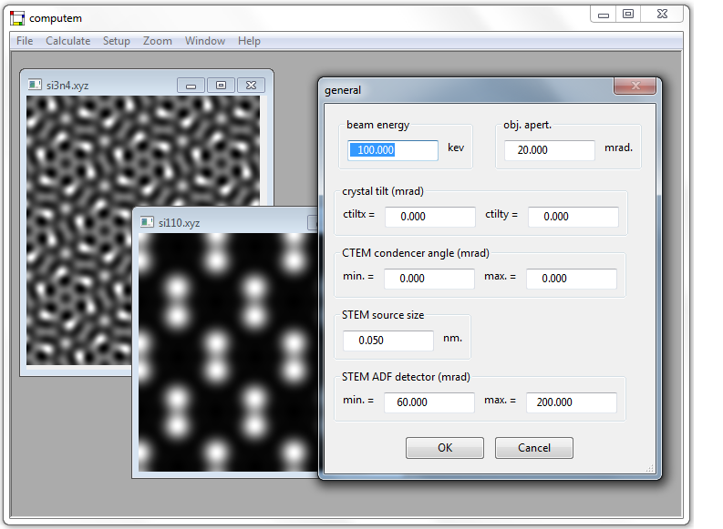

<!-- .slide: data-state="title" -->

# Electron Microscopy in the Age of   “*Big Data*”

&nbsp;

#### CCEM Summer School on Electron Microscopy <!-- .element: style="text-align: left;"-->

#### June 5, 2019 - Hamilton, ON <!-- .element: style="color: #a9a9a9; text-align: left;"-->

Joshua Taillon <!-- .element: class="author"-->

joshua.taillon@nist.gov <!-- .element: class="contact"-->

Note:

This talk could also be called "an introduction to computational microscopy"

<!--s-->

<!-- .slide: class="disclaimer" -->

## NIST Disclaimer

*Certain commercial equipment, instruments, materials, vendors, and software are
identified in this talk for example purposes and to foster understanding. Such
identification does not imply recommendation or endorsement by the National
Institute of Standards and Technology, nor does it imply that the materials or
equipment identified are necessarily the best available for the purpose.*

<!--s-->

## A Brief Introduction

- Materials scientist by training <!-- .element: class="fragment" data-fragment-index="1" -->

- Background in Materials characterization <!-- .element: class="fragment" data-fragment-index="2" -->
  - TEM, FIB/SEM, EDS/EELS, etc. <!-- .element: class="fragment" data-fragment-index="2" -->

- NIST Office of Data and Informatics <!-- .element: class="fragment" data-fragment-index="3" -->
  - <!-- .element: class="fragment" data-fragment-index="3" --> Not *actually* a microscopist any longer...

Note:

ODI contributes scientific value to research by providing guidance in best
practices and resources which optimize the discoverability, usability, and
interoperability of data products.  

ODI fosters collaboration and coordination among MML laboratory domain experts and other data specialists at NIST.

ODI supports development of research programs where advanced manipulation, visualization, and analysis of large data sets are needed to advance knowledge.

<!--s-->

## High-level Outline

- <!-- .element: class="fragment" data-fragment-index="1" --> What is *computational microscopy*?

- <!-- .element: class="fragment" data-fragment-index="2" --> Real-world examples of "big data" analysis in EM

- The advent of open tools <!-- .element: class="fragment" data-fragment-index="3" -->
  - <!-- .element: class="fragment" data-fragment-index="3" --> *Now you can get the same result as your neighbor!*

- <!-- .element: class="fragment" data-fragment-index="4" --> Deeper dive into "signal separation"
  - <!-- .element: class="fragment" data-fragment-index="4" --> Methods, examples, *gotchas*, etc.

<!--s-->

<!-- .slide: class="section_header" data-background="#303c6b"-->
## What is *computational microscopy*?

<!--s-->

## What *is not* CM?

<!-- .slide: class="text_left_im_right" -->

- Digitization

 <!-- .element: class="plain vertical-center" -->

From film to CCD (Ted Pella; Gatan)

<sticky>This is personal opinion! Feel free to disagree...</sticky><!-- .element: style="height:11.5%;" -->
<!-- .slide: data-transition="none" -->

<!--v-->
<!-- .slide: data-transition="none" -->

## What *is not* CM?

<!-- .slide: class="text_left_im_right" -->

- Digitization
- Image simulation

 <!-- .element: class="plain vertical-center" -->

EJ Kirkland; Multislice TEM Simulation

<sticky>This is personal opinion! Feel free to disagree...</sticky><!-- .element: style="height:11.5%;" -->

<!--v-->
<!-- .slide: data-transition="none" -->

## What *is not* CM?
<!-- .slide: class="text_left_im_right" -->

- Digitization
- Image simulation
- "Traditional" image analysis

 <!-- .element: class="plain vertical-center" style="background:none; top:40%; height:73%; right:4%;" -->

HRTEM Fourier analysis

<sticky>This is personal opinion! Feel free to disagree...</sticky><!-- .element: style="height:11.5%;" -->

<!--s-->

## Attempting a definition

*Microscopy directed by or collected primarily for computational processes
(as opposed to by/for the user directly)*

<sticky>This is personal opinion! Feel free to disagree...</sticky> <!-- .element: style="height:11.5%;" -->

<!-- .slide: data-transition="none" -->
<!--v-->
<!-- .slide: data-transition="none" -->

## Attempting a definition

<sticky>This is personal opinion! Feel free to disagree...</sticky> <!-- .element: style="height:11.5%;" -->
<!-- .slide: class="two-columns" -->

- Relevant buzzwords:

  

    <ul>  
      <ul>
        <li>Machine learning</li>
        <li>Artificial intelligence</li>
        <li>Autonomous measurement</li>
      </ul>
    </ul>
  

  

    <ul>  
      <ul>
        <li>Dynamic sampling</li>
        <li>Compressive sensing</li>
        <li>Sparse imaging</li>
      </ul>
    </ul>
  

<!--s-->

## Why computational microscopy?

- Statistical power <!-- .element: class="fragment" data-fragment-index="1" -->
  - Is your image actually *representative*? <!-- .element: class="fragment" data-fragment-index="1" -->
- Reproducibility is the default <!-- .element: class="fragment" data-fragment-index="2" -->
  - Computers only do what you tell them too (*we hope*) <!-- .element: class="fragment" data-fragment-index="2" -->
- Leverages massive advances in computational power <!-- .element: class="fragment" data-fragment-index="3" -->

<!--s-->

<!-- .slide: class="section_header" data-background="#303c6b"-->
## Some real-world examples of computational microscopy and "big data"

<!--s-->

## (1/4) ML for Factor Analysis

<!-- .slide: class="text_left_im_right tight_list" -->

<ul style="bottom: 25%; position: absolute;">
<li style="color: #729fcf;">O. Nicoletti, P. Midgley, et al., Nature, 502, 80-84, 2013 ([link](https://doi.org/10.1038/nature12469))</li>  
<li>Non-negative matrix factorization of EELS spectra</li>
<li>Identifying meaningful spectral components in a sea of overlapping signals</li>
<li>Combine with tilt-tomography for 3D information</li>
<li>Identified nanoparticle plasmon resonances</li>
</ul>

 <!-- .element: class="plain" style="max-width:50%; bottom:26%" -->

<!-- .slide: data-transition="none" -->
<!--v-->
<!-- .slide: data-transition="none" -->

## (1/4) ML for Factor Analysis

<!-- .slide: class="text_left_im_right tight_list" -->

<ul style="bottom: 25%; position: absolute;">
<li style="color: #729fcf;">O. Nicoletti, P. Midgley, et al., Nature, 502, 80-84, 2013 ([link](https://doi.org/10.1038/nature12469))</li>  
<li>Non-negative matrix factorization of EELS spectra</li>
<li>Identifying meaningful spectral components in a sea of overlapping signals</li>
<li>Combine with tilt-tomography for 3D information</li>
<li>Identified nanoparticle plasmon resonances</li>
</ul>

<video  style="width: 500px; bottom:30%"
        data-autoplay
        src="vid/nicoletti_nature_video.mp4" 
        controls
        loop>
</video>

<!--s-->

## (2/4) Autonomous Metrology

<!-- .slide: class="text_left_im_right tight_list" -->

<ul style="bottom: 25%; position: absolute; font-size:0.8em; max-width:35%">
<li style="color: #729fcf;">A. Kusne, I. Takeuchi, et al., Nanotechnology, 26, 444002, 2015 ([link](https://doi.org/10.1088/0957-4484/26/44/444002))</li>  
<li>High-throughput XRD for combinatorial materials discovery</li>
<li>Autonomous phase diagram mapping of composition spread wafer</li>
<li>Phase diagram is estimated at each step based on collected data and physics-informed ML algorithms</li>
<li>Unsupervised AI determines new composition to measure to best estimate phase diagram</li>
</ul>

<video  style="width:65% ; bottom:30%; max-width:100% !important; right:-5px"
        data-autoplay
        src="vid/akusne.mp4" 
        controls
        loop>
</video>

<!--s-->
## Example video

<!-- .slide: class="text_left_im_right" -->

<video  style="width: 400px;"
        data-autoplay
        src="vid/HAADF_EDS_mosaic.mp4"
        controls
        loop>
</video>

- test
  - test2

<!--s-->
## Why Microscopy?

**Seeing is believing!**

<html>
<table>
  <tr>
	<td> 
</td> <!-- .element: class="fragment" data-fragment-index="1" -->
	<td>
</td> <!-- .element: class="fragment" data-fragment-index="2" -->
	<td> 
</td> <!-- .element: class="fragment" data-fragment-index="3" -->
  </tr>
  <tr>
	<td>8x Optical</td> <!-- .element: class="fragment" data-fragment-index="1" -->
	<td>JWST</td> <!-- .element: class="fragment" data-fragment-index="2" -->
	<td>First TEM (Ruska and Knoll)</td> <!-- .element: class="fragment" data-fragment-index="3" -->
  </tr> 
</table> 
</html>

<!--s-->

## Why *Electron* Microscopy?

<html>
</html>

**Dramatic resolution improvement compared to visible light (or x-rays)...**

Rayleigh Criterion:   $\delta$ (resolution) $\approx 0.61\lambda$ (wavelength) <!-- .element: class="fragment" data-fragment-index="1" -->

<html>
<table align="center" style="width:100%; font-size:.7em">
  <thead style="border-top: 2px solid; border-bottom: 2px solid;">
	<th></th>
	<th>Wavelength</th>
	<th>Best Resolution</th>
  </thead>
  <tr>
	<td>Visible Light</td> 
	<td>380 nm to 750 nm</td> 
	<td> $\approx$ 200 nm*</td> 
  </tr>
  <tr>
	<td>X-rays</td> 
	<td>0.01 nm to 10 nm</td> 
	<td>$\approx$ 20 nm</td> 
  </tr> 
  <tr style="border-bottom: 2px solid;">
	<td>Electrons</td> 
	<td>0.002 nm to 0.004 nm</td> 
	<td class="fragment highlight-red">0.055 nm</td> 
  </tr> 
</table>  <!-- .element: class="fragment" data-fragment-index="2" -->
</html>

Note:
* Visible light microscopy resolution can be enhanced with post-processing super-resolution microscopy techniques
	* Best resolution is 10s of nm, but with some limitations

<!--s-->

<!-- .slide: class="section_header" data-background="#303c6b"-->

## Basics of Transmission Electron Microscopy

<!--s-->

<!-- .slide: class="tight_list" -->

## Brief history of TEM

* **1897/1924** – Thompson discovers electrons/De Broglie wave duality 
* **1931** – First research TEM (Ruska and Knoll) 
* **1943** – Electron energy loss spectroscopy (Hillier)
* **1956** – First HRTEM lattice image (Menter)
* **1964** – FEG Electron source (Crewe)
* **1970** – First demonstrated STEM (Crewe)
* **1986** – Digital CCD for TEM (Mochel)
* **2004** – Commercial aberration-corrected TEMs available

<!--s-->

## Brief introduction to TEM

* Fundamentally similar to transmitted light microscopy  <!-- .element: class="fragment" data-fragment-index="1" -->

* Electrons rather than photons <!-- .element: class="fragment" data-fragment-index="2" -->
	- Better resolution <!-- .element: class="fragment" data-fragment-index="2" -->
	- Electromagnetic lenses, rather than glass lenses <!-- .element: class="fragment" data-fragment-index="2" -->

* Easily combined with analytical techniques <!-- .element: class="fragment" data-fragment-index="3" -->
	- EELS, EDS, CL, etc. <!-- .element: class="fragment" data-fragment-index="3" -->
	- Enables chemical analysis together with structural information <!-- .element: class="fragment" data-fragment-index="3" -->

<!--s-->

## Brief introduction to TEM 

  
  
  
  
  

<!--s-->
	
## "Conventional" TEM

<!-- .slide: class="text_left_im_right" -->
<!-- .slide: li: style="font-size:0.85em"--> 

* Specimen illuminated with "parallel" beam of electrons

* Scattering of incident beam by specimen $\rightarrow$ contrast <!-- .element: class="fragment" data-fragment-index="1" -->
	* Diffraction and mass-thickness
	<!-- .element: class="fragment" data-fragment-index="2" -->
	* Phase contrast <!-- .element: class="fragment" data-fragment-index="3" -->
* Image intensity proportional to projected potential (approx.) <!-- .element: class="fragment" data-fragment-index="4" -->

 <!-- .element: style="height:70%; bottom:12%" class=" fragment fade-out" data-fragment-index="1" -->
 <!-- .element: style="height:70%; bottom:12%" class=" fragment fade-in" data-fragment-index="1" -->

Note: 
- Amplitude (mass) contrast used at lower magnifications for general imaging; diffraction contrast is used for defect analysis 
- Phase contrast is used more at the atomic level (HRTEM), for information about potentials

<!--s-->

## Scanning TEM

<!-- .slide: class="text_left_im_right" -->

* Specimen illuminated with converged beam of electrons
* Record point signal as beam scans sample
* Different detectors for different angles <!-- .element: class="fragment" data-fragment-index="1" -->
	
 <!-- .element: style="height:70%; bottom:12%" class="fragment fade-out" data-fragment-index="1" -->
 <!-- .element: style="height:63%; bottom:18%" class="fragment fade-in" data-fragment-index="1" -->

<!--s-->

## Scanning TEM

<!-- .slide: class="text_left_im_right" -->

* Image with transmitted, diffracted, or scattered electrons 
	* Bright field (BF) - *transmitted* e-
	* Annular dark field (ADF) - *Bragg diffracted* e-
	* High angle annular dark field (HAADF) - *Rutherford scattered* e-
	
 <!-- .element: style="height:63%; bottom:18%" class="" -->

<!--s-->

## HAADF-STEM

 <!-- .element: style="height:400px;" class="" -->

Can change angle of HAADF collection by adjusting camera length $(L)$ settings. Shorter $L$ increases collection angles $(\beta)$. <!-- .element: style="font-size:.8em;" class="" -->

Note:
- Images of diffraction plane with converged beam 
- On left, long camera length means BF collects just transmitted beam and ADF collection is within ZOLZ
- On right, all diffracted beams are inside of HAADF collection angle, so no diffraction effects and just Z contrast

<!--s-->

## HAADF-STEM Example

 <!-- .element: style="background:none; margin-bottom:0; height:450px;" class="plain" -->

Imaging Sb-implanted Si with different TEM modalities.   In HAADF-STEM, intensity $I \propto Z^2$ <!-- .element: style="font-size:.8em;" class="" -->

Note:

<!--s-->
## Potential TEM pitfalls
<!-- .slide: class="small_list text_left_im_right" -->

* Loss of depth information in projection
* Mixing of electron wavefunction phase/amplitude
* Diffraction/focus effects (particularly at edges)
* Delocalization of electron probe 
* Beam damage (and other dynamic effects)

 <!-- .element: style="bottom:30%" class="fragment fade-out" data-fragment-index="1" -->
 <!-- .element: style="bottom:30%; right:3%" class="fragment fade-in" data-fragment-index="1" -->

<!--s-->

## FIB/SEM sample prep
 <!-- .element: style="background:none; margin-bottom:0; bottom:25%; width:100%" class="plain" -->

<!--s-->

<!-- .slide: class="section_header" -->

## Basics of Electron Energy Loss Spectroscopy

<!--s-->

## Brief introduction to TEM <!-- .element: style="color:gray;" -->

  

<!--s-->

## Fundamental process

<!-- .slide: class="text_left_im_right" -->

- Incoming electron interacts with electron cloud
	- Many interactions; most used is core excitation
	- Creates characteristic x-ray
	- Electron loses energy (inelastic scattering)

 <!-- .element: style="background:none; margin-bottom:0; bottom:25%" class="" -->

<!--s-->

## EELS Instrumentation

 <!-- .element: style="height:450px; position:absolute; left:0; bottom:15%" class="fragment fade-out" data-fragment-index="1" -->
 <!-- .element: style="position:absolute; left:0; bottom:15%; height:450px; width:100%;" class="fragment fade-in" data-fragment-index="1"-->

<!--s-->

## Example EELS spectra

 <!-- .element: style="position:absolute; left:0; bottom:15%; height:450px; width:100%;" class="fragment fade-out" data-fragment-index="1"-->
 <!-- .element: style="position:absolute; left:0; bottom:15%; height:450px; width:100%;" class="fragment fade-in" data-fragment-index="1"-->
 <!-- .element: style="position:absolute; left:0; bottom:15%; height:450px; width:100%;" class="fragment fade-in" data-fragment-index="2"-->

<!--s-->

## Low-loss EEL spectra
<!-- .slide: class="small_list" -->

 <!-- .element: style="height:350px;" class="" -->

* Primary feature is zero-loss peak (ZLP)
	* Vast majority of electrons have no interaction
	* Can be used to measure energy resolution
	* Very intense, not enough dynamic range to capture entire spectrum at once

<!--s-->

## Low-loss EEL spectra
<!-- .slide: class="small_list" -->

 <!-- .element: style="height:350px; margin-top:58px;" class="" -->

* Next most intense is plasmon peak 
	* Collective excitation of electron gas by beam
	* Position of peak dependent on electron density
		* $ E_p = 28.82 \text{ eV} \sqrt{\frac{z \rho}{A}} $ (Drude model; see Egerton 2010)
	* Can be used for fingerprinting with known standards

Note:
* $z:$ # of free electrons per atom
* $\rho:$ specific gravity
* $A:$ atomic number

* also get surface plasmons, the energy of which are reduced by the permittivity of the vacuum (or other interface)

<!--s-->

## Core-loss EEL spectra
<!-- .slide: class="small_list" -->

  
  

* Provide information about tightly-bound electrons
	* Compositional information in edges (not peaks)
	* Power-law fitting background subtraction
	* ELNES provides information about electronic structure<!-- .element: class="fragment" data-fragment-index="1" -->
	* Core-loss edges continue beyond 2,000 eV <!-- .element: class="fragment" data-fragment-index="2" -->

<!--s-->

## EELS core-loss edges

<!-- .slide: class="text_left_im_right" -->

- Excitations of core-level electrons into empty states
- X-ray notation used instead of atomic <!-- .element: class="fragment" data-fragment-index="1" -->
	- $1s \rightarrow K$				<!-- .element: class="fragment" data-fragment-index="1" -->
	- $2s \rightarrow L_1$				<!-- .element: class="fragment" data-fragment-index="1" -->
	- $2p(\frac{1}{2},\frac{3}{2}) \rightarrow L_{2,3}$ <!-- .element: class="fragment" data-fragment-index="1" -->
	- Etc.								<!-- .element: class="fragment" data-fragment-index="1" -->

 <!-- .element: style="background:none; margin-bottom:0; bottom:25%" class="fragment fade-out" data-fragment-index="1" -->
 <!-- .element: style="background:none; margin-bottom:0; bottom:25%" class="fragment fade-in" data-fragment-index="1" -->

<!--s-->

## EELS composition quantification <!-- .element: style="font-size:1.7em" -->

 <!-- .element: style="position:absolute; left:5%; bottom:8%; height:550px; " class="plain "-->

Note:
- Co-L2,3 edge in this example

<!--s-->

## EELS composition quantification <!-- .element: style="font-size:1.7em" -->

<!-- .slide: class="text_left_im_right" -->

- Integrated intensities of edge give areal density
	- $N \approx \frac{I_c(\beta, \Delta)}{I_l(\beta,\Delta)} \sigma_c(\beta,\Delta)$
- Taking ratio of two elements makes low-loss and thickness info irrelevant:
	- $\frac{N^A}{N^B} = \frac{I_c^A(\beta,\Delta)}{I_c^B(\beta,\Delta)} \frac{\sigma_c^B(\beta,\Delta)}{\sigma_c^A(\beta,\Delta)}$

 <!-- .element: style="background:none; margin-bottom:0; bottom:25%" class="plain" -->

Note:
- Co-L2,3 edge in this example
- $\beta$ is collection semi-angle
- $\Delta$ is integration window
- $\sigma$ is partial scattering cross section
- $c$ is core-loss; $l$ is low-loss

<!--s-->

## Spectrum imaging

 <!-- .element: style="background:none; margin-bottom:0; height:450px;" class="" -->

Three-dimensional data collection process

<!--s-->

<!-- .slide: class="section_header" -->

## Some Real-world Examples

<!--s-->

<!-- .slide: class="section_header" -->

### Silicon carbide MOSFETs

<!--s-->

## SiC Semiconductors

* Wide bandgap (3.26 eV) material, good for power electronics
	* High mobility
	* High critical field
	* High thermal conductivity
* (Almost) drop in replacement for silicon 	<!-- .element: class="fragment" data-fragment-index="1" -->
	* Native SiO2 <!-- .element: class="fragment" data-fragment-index="1" -->
	* Lighter and more efficient than Si in high power <!-- .element: class="fragment" data-fragment-index="1" -->

Note:
mobility: about 900 cm2/Vs
critical field: about 3-5 MV/cm
thermal cond: 3.7 W/cm K

<!--s-->

## SiC promise

  

<!--s-->

## SiC structure
<!-- .slide: class="small_list" -->

  
  

SiC has over 250 polymorphs;  
We are interested in 4H for electrical devices <!-- .element: style="font-size:0.6em" -->

<!--s-->

## Issues facing SiC

<!-- .slide: class="text_left_im_right" li: style="font-size:0.85em"-->

- High wafer cost
	- Orders of magnitude higher than Si
- Low device mobility $(\mu_e)$ <!-- .element: class="fragment" data-fragment-index="1" -->
	- Interface traps within $E_g$ of 4H-SiC limit mobility to about 1% of bulk value <!-- .element: class="fragment" data-fragment-index="1" -->
- Limited device reliability <!-- .element: style="visibility:hidden" -->
	- Threshold ("on") voltage shifts with bias and temperature stress
	
 <!-- .element: style="background:none; margin-bottom:0; bottom:15%" class="" --> <!-- .element: class="fragment" data-fragment-index="1" -->

Note:

<!--s-->

## Issues facing SiC

<!-- .slide: class="text_left_im_right" li: style="font-size:0.85em"-->

- High wafer cost
	- Orders of magnitude higher than Si
- Low device mobility $(\mu_e)$
	- Interface traps within $E_g$ of 4H-SiC limit mobility to about 1% of bulk value 
- Limited device reliability 
	- Threshold ("on") voltage shifts with bias and temperature stress
	
 <!-- .element: style="background:none; margin-bottom:0; bottom:25%" class="" --> 

<!--s-->

## How to improve $\mu_e$?

<!-- .slide: li: style="font-size:0.85em"--> 

 <!-- .element: style="width:60%" -->

* NO annealing incorporates N at interface; with dramatic improvement in device mobility
	* Passivation of some mobility-limiting defects

<!--s-->

## How to improve $\mu_e$?

<!-- .slide: class="text_left_im_right" li: style="font-size:0.85em"-->

* Change substrate orientation
	* Relevant for trench MOSFET designs
* Dramatic improvement in mobility on a-face <!-- .element: class="fragment" data-fragment-index="1" -->
	* Origins not totally clear
	* Different surface termination on a-face

 <!-- .element: style="width:50%; bottom:7%" class="fragment fade-out" data-fragment-index="1" -->
 <!-- .element: style="height:76%; bottom:7%" class="fragment fade-in" data-fragment-index="1" -->

<!--s-->

## Opportunities for TEM

* Structure and chemical states at the interface are unclear
	* Nitrogen is there, but how is it incorporated?
	* Are there distinct chemical states (a "transition layer")?
* Effects of processing conditions and device orientation <!-- .element: class="fragment" data-fragment-index="1" -->
	* Does NO-annealing work differently on different surfaces?
	* How do different passivation strategies compare?

<!--s-->

<!-- .slide: class="section_header" -->

### Effect of NO-anneal time   on interfacial width

<!--s-->

## Investigating transition layer

<!-- .slide: .li: style="font-size:0.8em"--> 

 <!-- .element: class="plain" style="margin-top:5%; width:100%" -->

* NO annealing improves mobility, but no significant change in structure visible in HRTEM

<!--s-->

## Interfacial characterization

<html>
<table>
  <tr>
	<td> 
</td> 
<td> 
</td> 
  </tr>
  <tr>
	<td>HAADF-STEM</td> 
	<td>Si-$L_{2,3}$ edge at interface</td> 
  </tr> 
</table> <!-- .element: style="position:absolute; left: 6.8%;" -->
</html>

<!--s-->

## Core-level shifts

<!-- .slide: class="text_left_im_right" -->

- Between semiconductor and insulator, band diagram shifts
	- Bandgap grows, core levels depressed
	- $\Delta E_t$ corresponds to observed EELS edge onset shift

 <!-- .element: style="background:none; margin-bottom:0; bottom:8%" class="plain" -->

<!--s-->

## Interfacial characterization

<!-- .slide: class="text_left_im_right medium_list"-->

* Change in onset energy of edge reflects change in bandgap (roughly)
	* Probes bonding configuration of silicon atoms
	* Measure onset energy as function of NO-annealing time
	* Width of transition region defined as wTL

 <!-- .element: style="width:100%; bottom:23%" class="plain" -->

Note:
* 2/98% rise time analysis was the most reliable
* With a Gaussian beam assumption, this represents the contributions from 
	* 90% of the electrons, and is what is recommended by W&C 
* Averaged over many line scans taken from the sample, which is what gives the error bars shown on the next page.

<!--s-->

## NO time series results

<html>
<table>
  <tr>
	<td> 
</td> 
<td> 
</td> 
  </tr>
  <tr>
	<td>wTL decreases with NO anneal time</td> 
	<td>wTL inversely related to $\mu_e$</td> 
  </tr> 
</table> <!-- .element: style="position:absolute; left: 6.8%;" -->
</html>

<!--s-->

<!-- .slide: class="section_header" -->

### SiC substrate orientation effects

<!--s-->

## Samples investigated
<!-- .slide: class="text_left_im_right" li: style="font-size:0.85em"-->

 <!-- .element: style="height:75%; bottom:7%" class="" -->

* MOS devices in three substrate orientations:
	* Si-face with 4° miscut (commercial standard)
	* Si-face without miscut (poor epilayer growth)
	* a-face

* Processing conditions for each orientation:
	* Thermally oxidized
	* 2 hour post-oxidation anneal

<!--s-->

## HRTEM results
<!-- .slide: class="medium_list"-->

 <!-- .element: class="plain" style="margin-top:7%; width:80%" -->

* Like before, little structural evidence of interfacial states 

<!--s-->

## EELS analysis

  
  

* Need to analyze content of signal at interface, not just its size (beyond wTL) 

<!--s-->

## Hyperspectral decomposition
<!-- .slide: class="medium_list" -->

* Technique to recover multiple unknown signals from a spectrum image
* Consider a spectrum image as a matrix, and use matrix decomposition: <!-- .element: class="fragment" data-fragment-index="1" -->
	
$$ \text{Data} = \text{Scores} \times \text{Loadings} $$ <!-- .element: class="fragment" data-fragment-index="1" -->

$$\mathbf{D}\_{(x,y), E} = \mathbf{S}\_{(x,y), n} \times \mathbf{L}^T\_{(E,n)}$$ <!-- .element: class="fragment" data-fragment-index="2" -->

* Any decomposition strategy can be used <!-- .element: class="fragment" data-fragment-index="3" -->
	* Non-negative Matrix Factorization (NMF) suitable for EELS data <!-- .element: class="fragment" data-fragment-index="3" -->
	* Unbiased; unsupervised; only assumption is positivity of data <!-- .element: class="fragment" data-fragment-index="3" -->

Note:
- Data as matrix is product of what each component looks like times where that component is located
<!--s-->

## Hyperspectral software tool
<!-- .slide: class="smaller_list"-->

 <!-- .element: class="" style="margin-top:7%; width:85%" -->

* [HyperSpy](http://hyperspy.org): Open-source hyperspectral data analysis tool
	* Easy access to PCA, ICA, NMF, and signal modeling

<!--s-->

## Hyperspectral software tool
<!-- .slide: class="smaller_list"-->

 <!-- .element: class="" style="margin-top:7%; width:50%" -->

* [HyperSpy](http://hyperspy.org): Open-source hyperspectral data analysis tool
	* Can be used in Jupyter notebook for complete reproducibility 

<!--s-->

## Decomposing Si-L2,3 signal
<!-- .slide: class="smaller_list" -->

<html>
<table>
  <tr>
	<td></td> 
	<td></td> 
	<td style="width:30%;">
		<ul>
			<li>
			No significant variation between orientations
			<ul>
				<li>a-face results shown here</li>
			</ul>
			</li>
			<li>
			NO-anneal showed interfacial state in all samples
			<ul>
				<li>No such state in oxidized samples</li>
				<li>Very similar to Si3N4</li>
			</ul>
			</li>
		</ul>
	</td>
  </tr>
</table> <!-- .element: style="position:absolute; left: 6.8%;" -->
</html>

Note:

<!--s-->

## Analysis of Si-L2,3 signal
<!-- .slide: class="smaller_list" -->

<html>
<table>
  <tr>
	<td></td> 
	<td></td> <!-- .element: class="fragment" data-fragment-index="1" -->
  </tr>
  <tr>
  	<td>Effect of substrate orientation</td>
  	<td>Comparison to Si3N4 literature</td> <!-- .element: class="fragment" data-fragment-index="1" -->
  </tr>
</table> <!-- .element: style="position:absolute; left: 6.8%;" -->
</html>

Note:

<!--s-->

## Decomposing C-K signal
<!-- .slide: class="smaller_list" -->

<html>
<table>
  <tr>
	<td></td> 
	<td style="width:60%;">
		<ul>
			<li>
			Again, no significant variation between orientations
			<ul>
				<li>a-face results shown here</li>
			</ul>
			</li>
			<li>
			NO-anneal showed interfacial state in all samples
			<ul>
				<li>No such state in oxidized samples</li>
				<li>Very similar to the Si-L2,3 results</li>
			</ul>
			</li>
			<li>
			Interfacial state has pre-edge intensity
			<ul>
				<li>Indicative of $sp^2$-like bonding</li>
				<li>Influence of nitrogen is apparent</li>
			</ul>
			</li>
		</ul>
	</td>
  </tr>
</table> <!-- .element: style="position:absolute; left: 6.8%;" -->
</html>

Note:

<!--s-->

## Analysis of C-K signal
<!-- .slide: class="smaller_list" -->

 <!-- .element: class="plain" style="margin-top:7%; width:80%" -->

Note:
* As N content increases in C-N films, the pi-star peak grows, at the expense of the sigma-star peak
* Represents more directional trigonal bonding

<!--s-->

## Decomposing O-K signal
<!-- .slide: class="smaller_list" -->

<html>
<table>
  <tr>
	<td></td> 
	<td style="width:35%;">
		<ul>
			<li>Only sample with interface is a-face NO</li>
			<li>
			Interface has edge onset 2 eV to 3 eV below SiO2
			<ul>
				<li>Reduced bandgap</li>
				<li>Increased dielectric constant</li>
				<li>Enhanced mobility</li>
			</ul>
			</li>
			<li>
			Only clue as to enhanced mobility on the a-face
			<ul>
				<li>Silicon/carbon oxynitride configuration</li>
			</ul>
			</li>
		</ul>
	</td>
  </tr>
</table> <!-- .element: style="position:absolute; left: 6.8%;" -->
</html>

Note:

<!--s-->

## Orientation effects summary
<!-- .slide: class="medium_list" -->

* Thermally oxidized samples do not exhibit distinct bonding configurations at interface 
	* All NO-annealed samples did
* N from NO participates in bonding with Si and C, regardless of orientation <!-- .element: class="fragment" data-fragment-index="2" -->
* Oxide effects only observed on the a-face <!-- .element: class="fragment" data-fragment-index="3" -->
	* Potential origins of enhanced mobility
* Not shown: No differences between Si-face with and without miscut <!-- .element: class="fragment" data-fragment-index="4" -->
	* Miscut of substrate does not influence chemical states; just roughness

<!--s-->

<!-- .slide: class="section_header" -->

### Next-generation processing

<!--s-->

## Motivation
<!-- .slide: class="text_left_im_right" li: style="font-size:0.85em"-->

 <!-- .element: style=" bottom:20%; width:100%;" class="plain " -->

* "Next-generation" passivation techniques more poorly understood than NO process

* *Phosphorus* and *boron* passivations are particularly promising
	* Devices fabricated by S. Dhar's group at Auburn
	* One TEM study of P, none of B
	* How do they differ from NO-annealing?

<!--s-->

## Phosphorus imaging results

<html>
<table>
  <tr>
	<td></td> 
	<td></td> <!-- .element: class="fragment" data-fragment-index="1" -->
  </tr>
  <tr>
  	<td><strong>HRTEM of P-annealed interface</strong></td> <!-- .element: style="font-size:0.7em;" -->
  	<td><strong>HAADF-STEM of same interface</strong></td> <!-- .element: class="fragment" data-fragment-index="1" style="font-size:0.7em;"-->
  </tr>
</table> <!-- .element: style="position:absolute; left: 0%;" -->
</html>

Note:
* Processing:
	* XPS says bulk P content is 5 at. %
	* n-type epilayer; 1000C anneal for 15 min with Phosphorus
	* N2 gas through POCl3 bubbler, then "drive-in" anneal in N2

<!--s-->

## Phosphorus EELS results
<!-- .slide: class="smaller_list" -->

 <!-- .element: class="plain" style="margin-top:7%; width:100%" -->

Bright spots in HAADF-STEM image correspond to P-rich clusters <!-- .element: style="font-size:0.8em" -->

Note:
* Inhomogeneous phosphorus distribution
* Two types of oxide signals
* P-clusters are about 4 nm in diameter

<!--s-->

## Boron imaging results

<html>
<table>
  <tr>
	<td></td> 
	<td></td> <!-- .element: class="fragment" data-fragment-index="1" -->
  </tr>
  <tr>
  	<td><strong>HRTEM of B-annealed interface</strong></td> <!-- .element: style="font-size:0.7em;" -->
  	<td><strong>HAADF-STEM of same interface</strong></td> <!-- .element: class="fragment" data-fragment-index="1" style="font-size:0.7em;"-->
  </tr>
</table> <!-- .element: style="position:absolute; left: 0%;" -->
</html>

Note:
* Processing:
	* SIMS says average bulk B content is 10 at. %
	* n-type epilayer; 950C anneal in Ar for 30 min with ceramic B2O3 diffusion source
	* "drive-in" anneal in N2 for 2 hours

<!--s-->

## Boron EELS results
<!-- .slide: class="smaller_list" -->

 <!-- .element: class="plain" style="margin-top:7%; width:80%" -->

Boron accumulates at interface, but some distributed throughout oxide <!-- .element: style="font-size:0.7em" -->

Note:
* More homogeneous boron distribution
* 1 nm of diffusion into SiC
* Non-uniform concentration throughout oxide layer

<!--s-->

## "Next-generation" summary
<!-- .slide: class="medium_list" -->

* Both P and B incorporate into oxide differently than NO
	* More oxide impact than nitridation
* Phosphorus distributes into nm-sized P-rich clusters <!-- .element: class="fragment" data-fragment-index="1" -->
	* Impacts on polarization stability
	* Opportunities for gate oxide engineering
* Boron segregates to SiC/oxide interface <!-- .element: class="fragment" data-fragment-index="2" -->
	* Like NO, but more boron remaining through BSG layer
	* B diffuses slightly into SiC

<!--s-->

<!-- .slide: class="section_header" -->

### Solid oxide fuel cell (SOFC) cathode materials

<!--s-->

## Motivation

* Composite cathode SOFC materials degrade prematurely when exposed to certain atmospheres
	* H2O, CO2, Cr-vapor, etc.

* Analysis of degradation mechanisms is needed
	* LSM: $ (\mathrm{La}\_{0.8}\mathrm{Sr}\_{0.2})\_{0.95}\mathrm{MnO}\_{3+\delta}$
	* YSZ: $ (\mathrm{Y}\_2\mathrm{O}\_3)\_{0.08} (\mathrm{Zr}\mathrm{O}\_2)\_{0.92}$

* EELS provides a powerful chemical state analysis tool for these perovskite materials

<!--s-->

## H2O-aged LSM-YSZ EDS
<!-- .slide: class="text_left_im_right small_list"-->

 <!-- .element: style=" bottom:20%; max-width:50%; width:100%;" class="plain " -->

* TEM-EDS analysis of YSZ grain boundaries in composite cathode

* Mn and La observed to migrate to YSZ boundaries
	* Distribution of cations suggests surface diffusion mechanism

* What is chemical state of these mobile cations?
	

<!--s-->

## H2O-aged LSM-YSZ EELS
<!-- .slide: class="text_left_im_right small_list"-->

 <!-- .element: style=" bottom:15%; max-width:50%; width:100%;" class="plain " -->

* Analysis of the Mn-L edges

* Again, evidence of Mn at YSZ grain boundaries

* Intensity ratio of L2 and L3 peaks reveals information about average Mn valence
	* In this case, Mn2.5+
		* S. Shih, et al. *J. Electrochem. Soc.* **158**, B1276 (2011).
	* Charge balance will contribute to $V\_O^{\cdot\cdot}$ formation	
		* M. Backhaus-Ricoult, *Solid State Ionics* **177**, 2195 (2006). 

Note:
* L3/L2 ratio should be 2 in regular perovskite coordination
* Corresponds to Mn3+ and Mn4+

<!--s-->

## H2O-aged LSM-YSZ EELS
<!-- .slide: class="text_left_im_right small_list"-->

 <!-- .element: style=" bottom:15%; max-width:50%; width:100%;" class="plain " -->

* Analysis of the O-K edge

* Triple phase boundary locations reveal a clear surface state
	* Lack of peaks in ELNES suggests O-deficient oxide
	* Evidence of high oxygen vacancy concentration in LSM

* High $\left[V\_O^{\cdot\cdot}\right]$ encourages oxygen incorporation at surfaces
	* Agrees with kinetic enhancements observed under humidification during EIS

Note:
* Proof of mechanism proposed by Jimmi Nielsen

<!--s-->

## Degradation mechanism
<!-- .slide: class="smaller_list" -->

 <!-- .element: class="plain" style="margin-top:7%; width:80%" -->

* Degradation mode had been proposed, but not verified by TEM
	* J. Nielsen and M. Mogensen, *Solid State Ionics*. **189**, 74 (2011).

Note:
* More homogeneous boron distribution
* 1 nm of diffusion into SiC
* Non-uniform concentration throughout oxide layer

<!--s-->

## SOFC Summary

* EDS and EELS in the TEM can be used to analyze fuel cell materials

* Cation valence analysis enables insight into ionic state and defect distributions throughout the electrochemical system

* Evidence of cation migration and reduction of Mn at the LSM/YSZ interface
	* Impacts for short- and long-term kinetics of cell operation 

<!--s-->

<!-- .slide: class="section_header" -->

## End matter

<!--s-->

## Summary

* TEM is a powerful and versatile technique for materials analysis
	* Conventional, scanning, and high-angle imaging 
	* Sample preparation using FIB/SEM
	* Analytical strategies (EELS) 

* Data analysis methods: <!-- .element: class="fragment" data-fragment-index="1" -->
	- Machine learning tools enable new avenues of inquiry <!-- .element: class="fragment" data-fragment-index="1" -->

* Real-world examples: <!-- .element: class="fragment" data-fragment-index="2" -->
	- Detailed analysis of SiC MOS interfacial states <!-- .element: class="fragment" data-fragment-index="2" -->
	- Cation and vacancy analysis in SOFC cathodes <!-- .element: class="fragment" data-fragment-index="2" -->

<!--s-->

## More reading (1):
<!-- .slide: class="tight_list" -->

* *Transmission Electron Microscopy: A Textbook for Materials Science*, David Williams and Barry Carter (2009) - [link](http://www.springer.com/us/book/9780387765006)

* *Electron Energy-Loss Spectroscopy in the Electron Microscope*, Ray Egerton (2011) - [link](http://www.springer.com/us/book/9781441995827) 

* *Introduction to Focused Ion Beams*, Lucille Giannuzzi (2005) - [link](http://www.springer.com/us/book/9780387231167) 

<!--s-->

## More reading (2):
<!-- .slide: class="tight_list" -->

* *Scanning Transmission Electron Microscopy: Imaging and Analysis*, Stephen Pennycook (2010) - [link](http://www.springer.com/us/book/9781441971999)

* *Transmission Electron Microscopy and Diffractometry of Materials*, Fultz and Howe (2013) - [link](http://www.springer.com/us/book/9783642297601) 

* Paul Voyles, "Informatics and data science in materials microscopy", 
*Current Opinion in Solid State and Materials Science* (2016) - [link](http://www.sciencedirect.com/science/article/pii/S135902861630095X) 

<!--s-->

## Acknowledgments

<html>
<table>
  <tr>
	<td></td> 
	<td></td> 
	<td></td>
  </tr>
  <tr>
  	<td>GRFP - DGE 1322106</td> 
  	<td>W911NF-11-2-0044</td> 
	<td>SECA - DEFE 0009084</td>
  </tr>
</table> <!-- .element: style="position:absolute; left: 0%; font-size:0.6em" -->
</html>

<!--s-->

## Acknowledgments

* Collaborators:
	* Lourdes Salamanca-Riba - UMD
	* Leonard Feldman - Rutgers
	* Sarit Dhar - Auburn
	* Tsvetanka Zheleva - ARL
	* Aivars Lelis - ARL
	* Eric Wachsman - UMD

<!--s-->

## Thank you

Joshua Taillon

<a href="mailto:joshua.taillon@nist.gov">joshua.taillon@nist.gov</a>

<!--s-->

## References
<!-- .slide: class="reference" -->

* D. Williams and C. Carter, Transmission Electron Microscopy, 2nd ed. New York, NY: Springer Science, 2009.
* FEI Company, https://www.fei.com/image-gallery/logic-device2011/.
* T. Hoshino & S. Matsui, 47th International Conference on Electron, Ion and Photon Beam Technology and Nanofabrication (2003).
* J. Rozen, “Energy efficiency in high power electronics: role and challenges of silicon carbide interface,” in Human Photonics International Forum, Saitama University, 2012.
* R. Schörner, P. Friedrichs, D. Peters, and D. Stephani, “Significantly improved performance of MOSFETs on silicon carbide using the 15R-SiC polytype,” IEEE Electron Device Letters, vol. 20, no. 5, pp. 241–244, May 1999.
* A. J. Lelis, R. Green, D. B. Habersat, and M. El, “Basic mechanisms of threshold-voltage instability and implications for reliability testing of SiC MOSFETs,” IEEE Transactions on Electron Devices, vol. 62, no. 2, pp. 316–323, Feb. 2015.
* S. Dhar, S. Wang, A. Ahyi, T. Isaacs-Smith, S. T. Pantelides, J. R. Williams, and L. C. Feldman, “Nitrogen and hydrogen induced trap passivation at the SiO2/4H-SiC interface,” Materials Science Forum, vol. 527-529, pp. 949–954, 2006.
* T. S. Zheleva, A. J. Lelis, G. Duscher, F. Liu, I. Levin, and M. K. Das, “Transition layers at the SiO2 /SiC interface,” Applied Physics Letters, vol. 93, no. 2, p. 022 108, 2008.
* P. Liu, G. Li, G. Duscher, Y. Sharma, A. C. Ahyi, T. Isaacs-Smith, J. R. Williams, and S.Dhar,  “Roughness of the SiC/SiO2 vicinal interface and atomic structure of the transition layers”, Journal of Vacuum Science and Technology A, 32, 060603 (2014). 
* Y. Xu, X. Zhu, H. D. Lee, C. Xu, S. M. Shubeita, A. C. Ahyi, Y. Sharma, J. R. Williams, W. Lu, S. Ceesay, B. R. Tuttle, A. Wan, S. T. Pantelides, T. Gustafsson, E. L. Garfunkel, and L. C. Feldman, “Atomic state and characterization of nitrogen at the SiC/SiO2 interface,” Journal of Applied Physics, vol. 115, no. 3, p. 033 502, Jan. 2014.
* L. I. Johansson, C. Virojanadara, T. Eickhof, and W. Drube, “Properties of the SiO2/SiC interface investigated by angle resolved studies of the Si 2p and Si 1s levels and the Si KLL Auger transitions,” Surface Science, vol. 529, no. 3, pp. 515–526, 2003.
* H. Watanabe, T. Hosoi, T. Kirino, Y. Kagei, Y. Uenishi, A. Chanthaphan, A. Yoshigoe, Y. Teraoka, and T. Shimura, “Synchrotron x-ray photoelectron spectroscopy study on thermally grown SiO2/4H-SiC(0001) interface and its correlation with electrical properties,” Applied Physics Letters, vol. 99, no. 2, p. 021 907, 2011.
* G. Liu, A. C. Ahyi, Y. Xu, T. Isaacs-Smith, Y. K. Sharma, J. R. Williams, L. C. Feldman, and S. Dhar, “Enhanced inversion mobility on 4H-SiC (11-20) using phosphorus and nitrogen interface passivation,” IEEE Electron Device Letters, vol. 34, no. 2, pp. 181–183, Feb. 2013.
* S. Dhar, “Nitrogen and hydrogen induced trap passivation at the SiO2/4H-SiC interface,” PhD thesis, Vanderbilt University, 2005, p. 147.
* W. M. Skiff, R. W. Carpenter, and S. H. Lin, “Near-edge fine-structure analysis of core-shell electronic absorption edges in silicon and its refractory compounds with the use of electron-energy-loss microspectroscopy,” Journal of Applied Physics, vol. 62, no. 1987, pp. 2439–2449, 1987.
