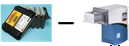
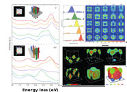
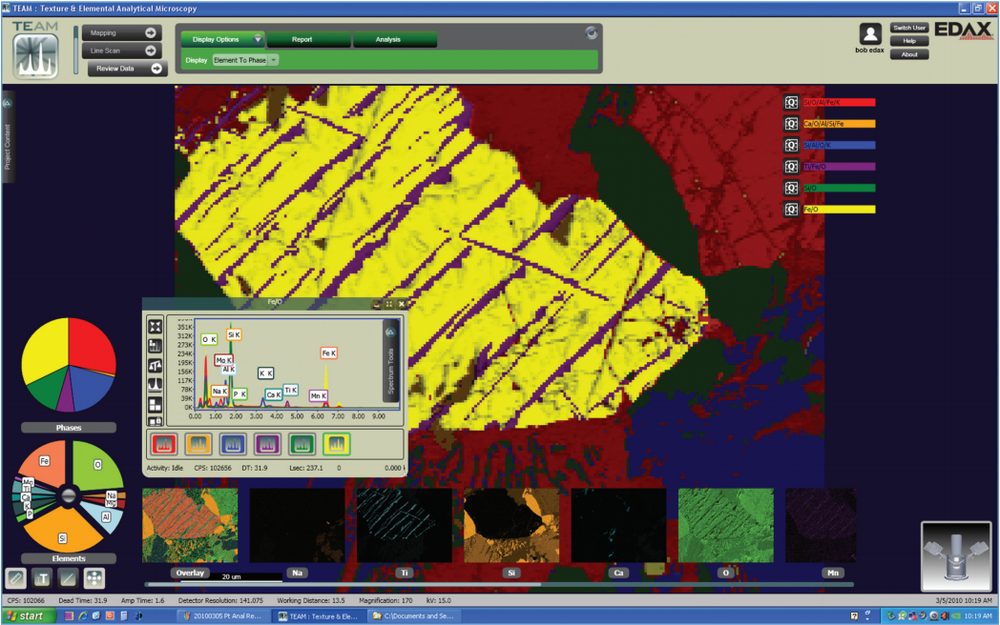
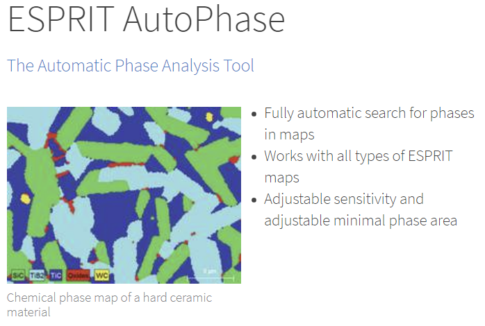
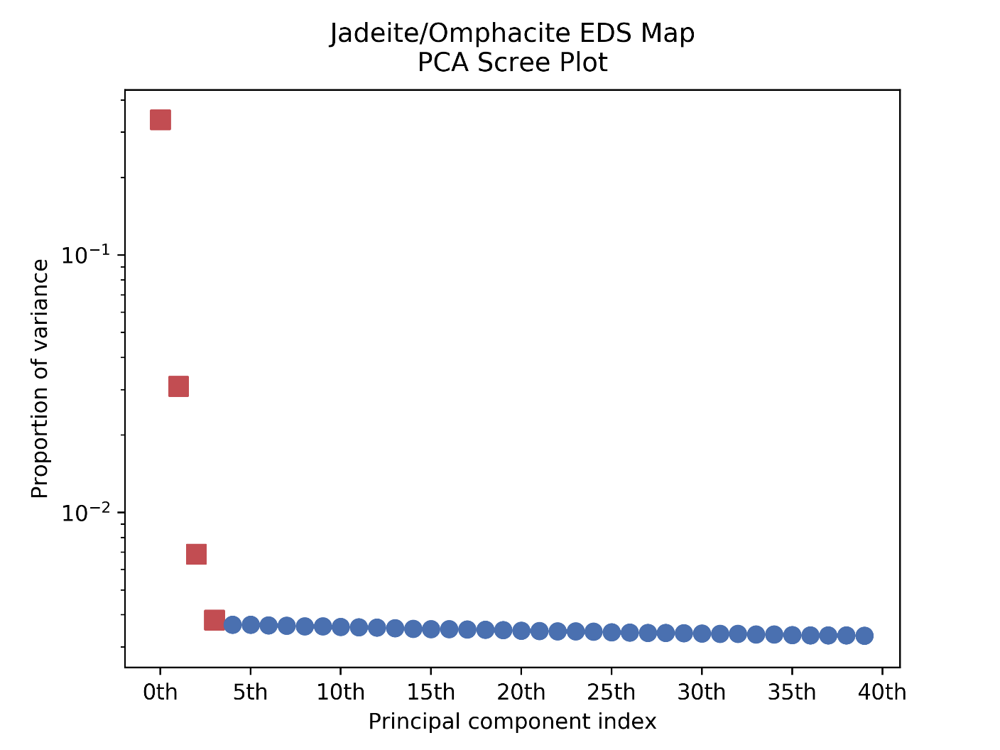

<!-- .slide: data-state="title" -->

# Electron Microscopy in the Age of <br/> “*Big Data*”

&nbsp;

#### CCEM Summer School on Electron Microscopy <!-- .element: style="text-align: left;"-->

#### June 5, 2019 - Hamilton, ON <!-- .element: style="color: #a9a9a9; text-align: left;"-->

Joshua Taillon <!-- .element: class="author"-->

joshua.taillon@nist.gov <!-- .element: class="contact"-->

Note:

This talk could also be called "an introduction to computational microscopy"

<!--s-->

<!-- .slide: class="disclaimer" -->

## NIST Disclaimer

*Certain commercial equipment, instruments, materials, vendors, and software are
identified in this talk for example purposes and to foster understanding. Such
identification does not imply recommendation or endorsement by the National
Institute of Standards and Technology, nor does it imply that the materials or
equipment identified are necessarily the best available for the purpose.*

<!--s-->

## A Brief Introduction

- Materials scientist by training <!-- .element: class="fragment" data-fragment-index="1" -->

- Background in Materials characterization <!-- .element: class="fragment" data-fragment-index="2" -->
  - TEM, FIB/SEM, EDS/EELS, etc. <!-- .element: class="fragment" data-fragment-index="2" -->

- Stumbled into the world of "advanced" data analysis  <!-- .element: class="fragment" data-fragment-index="3" -->
  - Do not consider myself a software developer  <!-- .element: class="fragment" data-fragment-index="3" -->

- NIST Office of Data and Informatics <!-- .element: class="fragment" data-fragment-index="4" -->
  - <!-- .element: class="fragment" data-fragment-index="4" --> Not *actually* a microscopist any longer...

Note:

ODI contributes scientific value to research by providing guidance in best
practices and resources which optimize the discoverability, usability, and
interoperability of data products.  

ODI fosters collaboration and coordination among MML laboratory domain experts and other data specialists at NIST.

ODI supports development of research programs where advanced manipulation, visualization, and analysis of large data sets are needed to advance knowledge.

<!-- .slide: data-transition="none" -->
<!--v-->
<!-- .slide: data-transition="none" -->

## About NIST

<div class="two-cols">
<div class="col">
  
  <div style="font-style: italic; color: #4a4a4a; font-size: x-large;">
    Gaithersburg, MD
  </div>
</div>
<div class="col">
  
  <div style="font-style: italic; color: #4a4a4a; font-size: x-large;">
    Boulder, CO
  </div>
</div>
</div>

<!-- .slide: data-transition="none" -->
<!--v-->
<!-- .slide: data-transition="none" -->

## Office of Data and Informatics
<!-- .slide: class="text_right_im_left" -->

 <!-- .element: class="plain vertical-center" style="left:5%; width:30%" -->

<ul style="font-size:0.8em;">
  <li>Provides data expertise and resources to NIST researchers</li>
  <li>Develops best practices to optimize FAIR data products</li>
  <li>Supports research into advanced manipulation, visualization, and analysis of large data sets</li>
</ul>

<!--s-->

## High-level Outline

- <!-- .element: class="fragment" data-fragment-index="1" --> What is *computational microscopy*?

- <!-- .element: class="fragment" data-fragment-index="2" --> Real-world examples of "big data" analysis in EM

- The advent of open tools <!-- .element: class="fragment" data-fragment-index="3" -->
  - <!-- .element: class="fragment" data-fragment-index="3" --> *Now you can get the same result as your neighbor!*

- <!-- .element: class="fragment" data-fragment-index="4" --> Deeper dive into "signal separation"
  - <!-- .element: class="fragment" data-fragment-index="4" --> Methods, examples, *gotchas*, etc.

<!--s-->

<!-- .slide: class="section_header" data-background="#303c6b"-->
## What is *computational microscopy*?

<!--s-->

## What *is not* CM?

<!-- .slide: class="text_left_im_right" -->

- Digitization

 <!-- .element: class="plain vertical-center" -->
<div class="fig-caption" style="bottom: 25%">From film to CCD<br/>(Ted Pella; Gatan)</div>

<sticky>This is personal opinion! Feel free to disagree...</sticky><!-- .element: style="height:11.5%;" -->
<!-- .slide: data-transition="none" -->

<!--v-->
<!-- .slide: data-transition="none" -->

## What *is not* CM?

<!-- .slide: class="text_left_im_right" -->

- Digitization
- Image simulation

 <!-- .element: class="plain vertical-center" -->
<div class="fig-caption" style="bottom: 20%">EJ Kirkland; Multislice TEM Simulation</div>
<sticky>This is personal opinion! Feel free to disagree...</sticky><!-- .element: style="height:11.5%;" -->

<!--v-->
<!-- .slide: data-transition="none" -->

## What *is not* CM?
<!-- .slide: class="text_left_im_right" -->

- Digitization
- Image simulation
- "Traditional" image analysis

 <!-- .element: class="plain vertical-center" style="background:none; top:40%; height:73%; right:4%;" -->
<div class="fig-caption" style="width:49%; bottom: 14%">HRTEM Fourier analysis</div>
<sticky>This is personal opinion! Feel free to disagree...</sticky><!-- .element: style="height:11.5%;" -->

<!--s-->

## Attempting a definition

*Microscopy directed by or collected primarily for computational processes
(as opposed to by/for the user directly)*

<sticky>This is personal opinion! Feel free to disagree...</sticky> <!-- .element: style="height:11.5%;" -->

<!-- .slide: data-transition="none" -->
<!--v-->
<!-- .slide: data-transition="none" -->

## Attempting a definition

<sticky>This is personal opinion! Feel free to disagree...</sticky> <!-- .element: style="height:11.5%;" -->
<!-- .slide: class="two-columns" -->

- Relevant buzzwords: <!-- .element: style="position:absolute; top:25%" -->

<div class="two-cols" style="top:28%">
  <div class="col">
    <ul>  
      <ul>
        <li>Machine learning</li>
        <li>Artificial intelligence</li>
        <li>Autonomous measurement</li>
      </ul>
    </ul>
  </div>

  <div class="col">
    <ul>  
      <ul>
        <li>Dynamic sampling</li>
        <li>Compressive sensing</li>
        <li>Sparse imaging</li>
      </ul>
    </ul>
  </div>
</div>
<!--s-->

## Why computational microscopy?

- Statistical power <!-- .element: class="fragment" data-fragment-index="1" -->
  - Is your image actually *representative*? <!-- .element: class="fragment" data-fragment-index="1" -->
- Reproducibility is the default <!-- .element: class="fragment" data-fragment-index="2" -->
  - Computers only do what you tell them too (*we hope*) <!-- .element: class="fragment" data-fragment-index="2" -->
- Leverages massive advances in computational power <!-- .element: class="fragment" data-fragment-index="3" -->

<!--s-->

<!-- .slide: class="section_header" data-background="#303c6b"-->
## Some real-world examples of computational microscopy and "big data"

<!--s-->

## (1/5) Electron Tomography

<!-- .slide: class="text_left_im_right tight_list" -->

<ul style="bottom: 25%; position: absolute;">
<li style="color: #729fcf;">Y. Yang, J. Miao, *et al.*, *Nature*, **542**, 75-79, 2017 ([link](https://doi.org/10.1038/nature21042))</li> <br>

<li>68 ADF-STEM images of FePt nanoparticle</li>
<li>Located 6,569 Fe and 16,627 Pt atoms to 21.6 pm precision (correlated with multislice simulations)</li>
<li>Calculated SROP to distinguish individual grains</li>
<li>3D information at the atomic scale</li>
</ul>

 <!-- .element: class="plain" style="max-width:35%; bottom:27%" -->
<div class="fig-caption" style="width:49%; bottom: 22%">Selection of nanoparticle tilt images</div>

<!-- .slide: data-transition="none" -->
<!--v-->
<!-- .slide: data-transition="none" -->

## (1/5) Electron Tomography

<video  class="center"
		style="width:65%;"
        data-autoplay
        src="vid/yang_nature_tomo.mp4"
        controls
        loop>
</video>

<!--s-->

## (2/5) ML for Factor Analysis

<!-- .slide: class="text_left_im_right tight_list" -->

<ul style="bottom: 25%; position: absolute;">
<li style="color: #729fcf;">O. Nicoletti, P. Midgley, *et al.*, *Nature*, **502**, 80-84, 2013 ([link](https://doi.org/10.1038/nature12469))</li> <br>
<li>Non-negative matrix factorization of EELS spectra</li>
<li>Identifying meaningful spectral components in a sea of overlapping signals</li>
<li>Combine with tilt-tomography for 3D information</li>
<li>Identified nanoparticle plasmon resonances</li>
</ul>

 <!-- .element: class="plain" style="max-width:50%; bottom:26%" -->

<!-- .slide: data-transition="none" -->
<!--v-->
<!-- .slide: data-transition="none" -->

## (2/5) ML for Factor Analysis

<!-- .slide: class="text_left_im_right tight_list" -->

<ul style="bottom: 25%; position: absolute;">
<li style="color: #729fcf;">O. Nicoletti, P. Midgley, *et al.*, *Nature*, **502**, 80-84, 2013 ([link](https://doi.org/10.1038/nature12469))</li> <br>
<li>Non-negative matrix factorization of EELS spectra</li>
<li>Identifying meaningful spectral components in a sea of overlapping signals</li>
<li>Combine with tilt-tomography for 3D information</li>
<li>Identified nanoparticle plasmon resonances</li>
</ul>

<video  style="width: 500px; bottom:30%"
        data-autoplay
        src="vid/nicoletti_nature_video.mp4"
        controls
        loop>
</video>

<!--s-->

## (3/5) Autonomous Metrology

<!-- .slide: class="text_left_im_right tight_list" -->

<ul style="bottom: 25%; position: absolute; font-size:0.8em; max-width:35%">
<li style="color: #729fcf;">A. Kusne, I. Takeuchi, *et al.*, *Nanotechnology*, **26**, 444002, 2015 ([link](https://doi.org/10.1088/0957-4484/26/44/444002))</li> <br>
<li>High-throughput XRD for combinatorial materials discovery</li>
<li>Autonomous phase diagram mapping of composition spread wafer</li>
<li>Phase diagram is estimated at each step based on collected data and physics-informed ML algorithms</li>
<li>Unsupervised AI determines new composition to measure to best estimate phase diagram</li>
</ul>

<video  style="width:65% ; bottom:30%; max-width:100% !important; right:-5px"
        data-autoplay
        src="vid/akusne.mp4"
        controls
        loop>
</video>

<!--s-->

## (4/5) Dynamic Sampling in SEM

<!-- .slide: class="text_left_im_right tight_list" -->

<ul style="bottom: 25%; position: absolute; font-size:0.8em; max-width:35%">
<li style="color: #729fcf;">G. Godaliyadda, C. Bouman, *et al.*,
*Electronic Imaging*, **19**, 1-8, 2016 ([link](https://engineering.purdue.edu/~bouman/software/SLADS/))</li> <br>
<li>Supervised Learning Approach to Dynamic Sampling (SLADS)</li>
<li>Sparse imaging and weighted inpainting reconstruction</li>
<li>Train algorithm offline to measure how much certain types of pixels reduce overall distortion</li>
<li>Online, pick new pixels to reduce expected distortion in reconstruction</li>
</ul>

 <!-- .element: class="plain vertical-center" style="max-width:100% !important; width:65%; right:-5%; top:45%;" -->
<div class="fig-caption" style="width:49%; bottom: 22%">Simulated EBSD patterns</div>

Note:

LS is low-discrepancy sequencing (grid + random jitter)

<!-- .slide: data-transition="none" -->
<!--v-->
<!-- .slide: data-transition="none" -->

## (4/5) Dynamic Sampling in SEM

<!-- .slide: class="text_left_im_right tight_list" -->

<ul style="bottom: 25%; position: absolute; font-size:0.8em; max-width:35%">
<li style="color: #729fcf;">G. Godaliyadda, C. Bouman, *et al.*,
*Electronic Imaging*, **19**, 1-8, 2016 ([link](https://engineering.purdue.edu/~bouman/software/SLADS/))</li> <br>
<li>Supervised Learning Approach to Dynamic Sampling (SLADS)</li>
<li>Sparse imaging and weighted inpainting reconstruction</li>
<li>Train algorithm offline to measure how much certain types of pixels reduce overall distortion</li>
<li>Online, pick new pixels to reduce expected distortion in reconstruction</li>
</ul>

 <!-- .element: class="plain vertical-center" style="max-width:100% !important; width:65%; right:-5%; top:45%;" -->
<div class="fig-caption" style="width:49%; bottom: 22%">Experimental SEM images</div>

<!--s-->

## (5/5) STEM CS

<!-- .slide: class="text_left_im_right tight_list" -->

<ul style="bottom: 25%; position: absolute; font-size:0.9em; max-width:35%">
<li style="color: #729fcf;">A. Stevens, N. Browning, *et al.*,
*Microscopy*, **63**, 41-51, 2014. ([link](https://doi.org/10.1093/jmicro/dft042))</li> <br>
<li>Intentionally acquire image at severe undersampling conditions</li>
<li>Use $\ell_1$-norm convex optimization to fill in the missing details</li>
<li>An interesting means to get around the Nyquist-Shannon limit</li>
<li>Demonstrated with random sampling in both STEM and SEM</li>
</ul>

 <!-- .element: class="plain vertical-center" style="max-width:100% !important; width:55%; right:-5%; top:40%;" -->
<div class="fig-caption" style="width:55%; bottom: 15%">Compressed Sensing STEM reconstructions</div>

<!--s-->

<!-- .slide: class="section_header" data-background="#303c6b"-->
## Open tools for electron microscopy

<!--s-->

<!-- .slide: class="one_image" -->


<div class="fig-caption">Randall Munroe - <a href="https://xkcd.com/">xkcd</a></div>

<!--s-->

## A "typical" EM analysis

<!-- .slide: class="text_left_im_right tight_list" -->

- One or more software packages typically necessary
- Often vendor-provided
- GUI-driven with many options, sometimes “black-box”
- Typically, no log recorded
  - Hope you keep a good notebook!
  - Can you reproduce your post-doc's analysis?
- Tightly integrated with equipment/acquisition

 <!-- .element: class="plain vertical-center" style="max-width:100% !important; width:45%; right:0%; top:45%;" -->
<div class="fig-caption" style="width:55%; bottom: 15%">Extracting EELS intensity profile in Gatan Digital Micrograph</div>

<!-- .slide: data-transition="none" -->
<!--v-->
<!-- .slide: data-transition="none" -->

## A better way?

<!-- .slide: class="text_left_im_right tight_list" -->

- A "typical" EELS analysis, but totally reproducible <!-- .element: style="color: #303c6b;" -->
<br/><br/>
- Computation within a “notebook” environment
- Seamless mixing of notetaking, mathematics, and data analysis
- Notebook is rendered in any web browser
- Version controlled and exportable to PDF, HTML, Markdown, etc.

 <!-- .element: class="plain vertical-center" style="max-width:100% !important; width:55%; right:-5%; top:45%;" -->
<div class="fig-caption" style="width:60%; bottom: 15%">Notebook compared to GUI</div>

<!-- .slide: data-transition="none" -->
<!--v-->
<!-- .slide: data-transition="none" -->

## A better way?

```python
import hyperspy.api as hs
s = hs.load('EELS Spectrum Image.dm3')
s_sig = s.remove_background(signal_range=(70.2, 97.2))
s_crop = s_sig.inav[:, 12:62].isig[94.5:110.1]
s_crop.sum(axis=(1,-1)).plot()
```

<div class="fig-caption" style="max-width:100%; width:100%; bottom: 35%">Only 5 lines of code!</div>
<sticky style="max-width:20%;">Please join one of the HyperSpy tutorials this week if you want to learn more!</sticky>
<!--s-->

## A burgeoning ecosystem

<table id="ecosystem" style="max-width:100%; width:100%; height:100%;font-size:.5em; margin-left:0%;">
  <tr style="font-weight:bold;">
    <th colspan="2">General Purpose</th>
    <th></th>
    <th colspan="2">Others</th>
  </tr>
  <tr>
    <td>HyperSpy</td>
    <td style="text-align:left;">http://hyperspy.org/</td>
    <td></td>
    <td>PyQSTEM</td>
    <td style="text-align:left;">https://github.com/jacobjma/PyQSTEM</td>
  </tr>
  <tr>
    <td>Nion Swift</td>
    <td style="text-align:left;">https://nionswift.readthedocs.io/en/stable/</td>
    <td></td>
    <td>HRTEMFringeAnalyzer</td>
    <td style="text-align:left;">https://github.com/ialxn/HRTEMFringeAnalyzer</td>
  </tr>
  <tr>
    <td>`pycroscopy`</td>
    <td style="text-align:left;">https://github.com/pycroscopy/pycroscopy</td>
    <td></td>
    <td>Atomap</td>
    <td style="text-align:left;">https://atomap.org/</td>
  </tr>

  <tr style="line-height:2em;">
    <td>&nbsp;</td>
    <td></td>
    <td></td>
    <td></td>
    <td></td>
  </tr>

  <tr style="font-weight:bold;">
    <td colspan="2">Pixelated STEM</td>
    <td></td>
    <td colspan="2">Tomography</td>
  </tr>
  <tr>
    <td>pyXem</td>
    <td style="text-align:left;">https://pyxem.github.io/pyxem/</td>
    <td></td>
    <td>tomopy</td>
    <td style="text-align:left;">https://tomopy.readthedocs.io/en/latest/</td>
  </tr>
  <tr>
    <td>pixStem</td>
    <td style="text-align:left;">https://pixstem.org/</td>
    <td></td>
    <td>`tomotools`</td>
    <td style="text-align:left;">https://github.com/AndrewHerzing/tomotools</td>
  </tr>
  <tr>
    <td>LiberTEM</td>
    <td style="text-align:left;">https://github.com/LiberTEM/LiberTEM</td>
    <td></td>
    <td>tomviz</td>
    <td style="text-align:left;">https://tomviz.org/</td>
  </tr>
  <tr>
    <td>`fpd`</td>
    <td style="text-align:left;">https://gitlab.com/fpdpy/fpd/</td>
    <td></td>
    <td></td>
    <td></td>
  </tr>
</table>

<div class="fig-caption" style="max-width:100%; width:100%; bottom: 15%">And many others (all free!)...</div>

<!-- .slide: data-transition="none" -->
<!--v-->
<!-- .slide: data-transition="none" -->

## All built on Python!

<!-- .slide: id="python_ecosystem" -->

<div>
  <a href="https://www.python.org/" title="Python" target="_blank"></a> &nbsp;&nbsp;&nbsp;&nbsp;
  <a href="https://www.numpy.org/" target="_blank" title="NumPy"></a> &nbsp;&nbsp;&nbsp;&nbsp;
  <a href="https://jupyter.org/" target="_blank" title="Jupyter"></a> &nbsp;&nbsp;&nbsp;&nbsp;
  <a href="https://www.scipy.org/" target="_blank" title="SciPy"></a>
</div>

<div class="fig-caption" style="max-width:100%; width:100%; bottom: 25%">Click to visit each project</div>

<!--s-->

<!-- .slide: class="section_header" data-background="#303c6b"-->
## Unsupervised hyperspectral signal separation <br/> (spectral unmixing)

<!--s-->

## Overview

- <!-- .element: class="fragment" data-fragment-index="1" --> What techniques is this applicable to?

- <!-- .element: class="fragment" data-fragment-index="2" --> What is unmixing (phase mapping)?

- <!-- .element: class="fragment" data-fragment-index="3" --> Vendor options vs. open solutions

- <!-- .element: class="fragment" data-fragment-index="4" --> Demonstration of a few different unmixing algorithms

<!--s-->

## Applicable techniques

<!-- .slide: class="technique_list" -->

- Raster-based scanning spectroscopic methods:
  - Scanning transmission electron microscopy (STEM)
    - Electron energy-loss spectroscopy (EELS) and EDS
  - Scanning electron microscopy (SEM)
    - X-ray energy dispersive spectroscopy (EDS)
  - X-ray fluorescence spectroscopy mapping (XRF and μXRF)
  - Infrared spectroscopy mapping (FTIR)

- Image-based methods
  - Time series images of kinetic behaviors
  - Through-focal series in TEM (extracting true structure)

<!-- .slide: data-transition="none" -->
<!--v-->
<!-- .slide: data-transition="none" -->

## Applicable techniques

<!-- .slide: class="technique_list" -->

- <!-- .element: style="opacity:0.2" --> Raster-based scanning spectroscopic methods:
  - <!-- .element: style="opacity:0.2" -->Scanning transmission electron microscopy (STEM)
    - Electron energy-loss spectroscopy (EELS) and EDS
  - Scanning electron microscopy (SEM)
    - X-ray energy dispersive spectroscopy (EDS)
  - <!-- .element: style="opacity:0.2" -->X-ray fluorescence spectroscopy mapping (XRF and μXRF)
  - <!-- .element: style="opacity:0.2" -->Infrared spectroscopy mapping (FTIR)

- <!-- .element: style="opacity:0.2" -->Image-based methods
  - <!-- .element: style="opacity:0.2" -->Time series images of kinetic behaviors
  - <!-- .element: style="opacity:0.2" -->Through-focal series in TEM (extracting true structure)

<!--s-->

## X-ray energy dispersive spectroscopy (EDS) <!-- .element: style="font-size:1.3em;" -->

<div class="two-cols"  style="top:14%;">
<div class="col">
  
  <div style="color: #4a4a4a; font-size: 0.5em;">
    Williams and Carter, *Transmission Electron <br/> Microscopy*, p. 55 (2009)
  </div>
</div>
<div class="col" style="margin-top: 10%;">
  
  <div style="margin-left:auto; margin-right:auto; width:90%;
              color:#4a4a4a; text-align:justify; font-size:0.4em;">
    EDS spectrum of the mineral crust of the vent shrimp
    [*Rimicaris exoculata*](https://en.wikipedia.org/wiki/Alvinocarididae#Rimicaris).
    Most of these peaks are X-rays given off as electrons return to the K
    electron shell.([K-alpha](https://en.wikipedia.org/wiki/K-alpha) and
    [K-beta](https://en.wikipedia.org/wiki/K-beta) lines) One peak is from the
    L shell of iron.
    ([source](https://en.wikipedia.org/wiki/Energy-dispersive_X-ray_spectroscopy))
  </div>
</div>
</div>

<!--s-->

## <!-- .element: style="font-size:1.3em;" --> What *is* hyperspectral unmixing?
<!-- .slide: class="one_image" -->

- Start with some hyperspectral data:
<br/>


<div class="fig-caption" style="margin-right:20%; text-align:right; bottom:20%">Image courtesy of Gatan, Inc.</div>

<!-- .slide: data-transition="none" -->
<!--v-->
<!-- .slide: data-transition="none" -->

## <!-- .element: style="font-size:1.3em;" --> What *is* hyperspectral unmixing?


  


<!-- .slide: data-transition="none" -->
<!--v-->
<!-- .slide: data-transition="none" -->

## <!-- .element: style="font-size:1.3em;" --> What *is* hyperspectral unmixing?


<!--s-->

## What do the vendors offer?

<ul style="position:absolute;font-size:0.7em; top:20%">
  <li>
    If you've used a modern EDS software package, you probably
    have done hyperspectral unmixing (they usually call it *phase mapping*)...
  </li>
</ul>

<div class="two-cols"  style="top:14%;">
<div class="col" style="margin-top: 15%;">
  
  <div style="margin-left:auto; margin-right:auto; width:90%;
              color:#4a4a4a;font-size:0.8em;">
    Oxford - AutoPhaseMap
  </div>
</div>
<div class="col" style="margin-top: 15%;">
  
  <div style="max-height:25%;margin-left:auto; margin-right:auto; width:90%;
              color:#4a4a4a;font-size:0.8em;">
    EDAX - Smart Phase Mapping
  </div>
</div>
</div>

<!-- .slide: data-transition="none" -->
<!--v-->
<!-- .slide: data-transition="none" -->

## What do the vendors offer?

<ul style="position:absolute;font-size:0.7em; top:20%">
  <li>
    If you've used a modern EDS software package, you probably
    have done hyperspectral unmixing (they usually call it *phase mapping*)...
  </li>
</ul>

<div class="two-cols"  style="top:14%;">
<div class="col" style="margin-top: 15%;">
  
  <div style="margin-left:auto; margin-right:auto; width:90%;
              color:#4a4a4a;font-size:0.8em;">
    Bruker - AutoPhase
  </div>
</div>
<div class="col" style="margin-top: 15%;">
  
  <div style="max-height:25%;margin-left:auto; margin-right:auto;margin-top:5%; width:90%;
              color:#4a4a4a;font-size:0.8em;">
    Thermo Fisher - COMPASS
  </div>
</div>
</div>

<!--s-->

<!-- .slide: style="width:110%" -->

## <!-- .element: style="font-size:1.3em;" --> Strengths/challenges of <em style="color:#2387de">vendor</em> options

<div class="two-cols"  style="width:100%; top:17%;">
<div class="col pro-con" style="width:45%">
  <div style="text-align:center; color:#00b050;
              font-weight:bold; font-size:1.5em;
              margin-left:-20%;">
    The Good
  </div>
  <ul style="margin-right:5%;margin-top:5%">
    <li>Simple point-and-click operation</li>
    <li>Tight integration</li>
    <ul>
      <li>
        Collection, visualization, reporting, etc.
      </li>
    </ul>
    <li>
      Usually runs in real-time
    </li>
    <li>
      Integration with other data sources (*e.g.* EBSD)
    </li>
    <li>
      Generally "just works"
    </li>
  </ul>
</div>
<div data-fragment-index="1" class="fragment col pro-con" style="width:45%">
  <div style="text-align:center; color:#c00000;
              font-weight:bold; font-size:1.5em;
              margin-left:-20%;">
    The Not So Good
  </div>
    <ul style="margin-left:5%;margin-top:5%">
    <li>Extremely "black box"</li>
    <li>Reproducibility (!)</li>
    <ul>
      <li>
        Configurable options with little understanding of why
      </li>
    </ul>
    <li>
      What are the uncertainties?
    </li>
    <li>
      Tied to software ($)
    </li>
    <li>
      Choice of vendor should not change the scientific result
    </li>
  </ul>
</div>
</div>

<!-- .slide: data-transition="none" -->
<!--v-->
<!-- .slide: data-transition="none" -->

<!-- .slide: style="width:110%" -->

## <!-- .element: style="font-size:1.3em;" --> Strengths/challenges of <em style="color:#2387de">open source</em> options

<div class="two-cols"  style="width:100%; top:17%;">
<div class="col pro-con" style="width:45%">
  <div style="text-align:center; color:#c00000;
              font-weight:bold; font-size:1.5em;
              margin-left:-20%;">
    The Not So Good
  </div>
  <ul style="font-size:0.9em;margin-right:5%;margin-top:5%">
    <li>Usually not point-and-click</li>
    <li>(Can be) difficult to access raw data from the vendor software</li>
    <li>Generally only post-processing</li>
    <li>Learning curve can be substantial</li>
    <li>Can take a lot more fiddling</li>
  </ul>
</div>
<div data-fragment-index="1" class="fragment col pro-con" style="width:45%">
  <div style="text-align:center; color:#00b050;
              font-weight:bold; font-size:1.5em;
              margin-left:-20%;">
    The Good
  </div>
    <ul style="margin-left:5%;margin-top:5%">
    <li>You know what’s happening</li>
    <li>Reproducibility (!)</li>
    <ul>
      <li>Anyone can recreate your analysis (including you!)</li>
    </ul>
    <li>Uncertainty can be understood</li>
    <li>Usually free</li>
    <li>Results do not depend on vendor</li>
  </ul>
</div>
</div>

<!--s-->

## Offline "phase mapping"

<br/>

- Many algorithms exist to solve:&nbsp;&nbsp; $\mathbf{D}\_{\left(x,y\right),E}=\mathbf{W}\_{\left(x,y\right)} \times \mathbf{S}\_E$
  - <!-- .element: style="font-size:0.8em;" --> Assumptions implicit in each affect their suitability for EDS

- Primary methods:
  - <!-- .element: style="font-size:0.8em;" --> Principal component analysis (PCA) &mdash; finds non-physical spectra that describe the most variance in the datacube
  - <!-- .element: style="font-size:0.8em;" --> Independent component analysis (ICA) &mdash; maximizes independence between spectral results
  - <!-- .element: style="font-size:0.8em;" --> Multivariate curve resolution (MCR) and non-negative matrix factorization (NMF) &mdash; enforce positivity in spectral components and weights

<!-- .slide: data-transition="none" -->
<!--v-->
<!-- .slide: data-transition="none" -->

## Offline "phase mapping"

<br/>

- Many algorithms exist to solve:&nbsp;&nbsp; $\mathbf{D}\_{\left(x,y\right),E}=\mathbf{W}\_{\left(x,y\right)} \times \mathbf{S}\_E$
  - <!-- .element: style="font-size:0.8em;" --> Assumptions implicit in each affect their suitability for EDS

- Other methods:
  - <!-- .element: style="font-size:0.8em;" --> Geometric methods &mdash; Vertex component analysis (VCA), Minimum volume simplex analysis (MVSA), and others...
  - <!-- .element: style="font-size:0.8em;" --> Monte Carlo methods &mdash; Bayesian linear unmixing (BLU)
  - <!-- .element: style="font-size:0.8em;" --> Clustering methods &mdash; k-means, Gaussian mixture modeling (GMM) <br/><br/><br/><br/>

<!--s-->

## Looking at some real data...
<!-- .slide: class="text_left_im_right tight_list" -->

<ul style="font-size:0.95em;">
  <li style="font-weight:bold!important;">SEM-EDS mapping data</li>
  <li style="font-weight:bold!important;">Japan 1957 Research Specimen from Freer Gallery of Art</li>
  <ul>
    <li>Data from an ongoing research project at Smithsonian’s Museum Conservation Institute</li>
    <li>Courtesy of Thomas Lam and Edward P. Vicenzi</li>
  </ul>
  <li style="font-weight:bold!important;">Map specifics:</li>
  <ul>
    <li>30 keV primary beam</li>
    <li>512 x 384 pixels; 1564 spectral channels</li>
    <li>Jadeite (NaAlSi<sub>2</sub>O<sub>6</sub>) and Omphacite ((Ca,Na)(Mg,Fe<sup>2+</sup>,Al)Si<sub>2</sub>O<sub>6</sub>)</li>
  </ul>
</ul>

 <!-- .element: class="plain vertical-center" style="background:none;max-width:100% !important; width:40%; right:0%; top:50%;" -->

<!-- .slide: data-transition="none" -->
<!--v-->
<!-- .slide: data-transition="none" -->

## Looking at some real data...
<!-- .slide: class="text_left_im_right tight_list" -->

<ul style="font-size:0.95em;">
  <li style="font-weight:bold!important;">SEM-EDS mapping data</li>
  <li style="font-weight:bold!important;">Japan 1957 Research Specimen from Freer Gallery of Art</li>
  <ul>
    <li>Data from an ongoing research project at Smithsonian’s Museum Conservation Institute</li>
    <li>Courtesy of Thomas Lam and Edward P. Vicenzi</li>
  </ul>
  <li style="font-weight:bold!important;">Map specifics:</li>
  <ul>
    <li>30 keV primary beam</li>
    <li>512 x 384 pixels; 1564 spectral channels</li>
    <li>Jadeite (NaAlSi<sub>2</sub>O<sub>6</sub>) and Omphacite ((Ca,Na)(Mg,Fe<sup>2+</sup>,Al)Si<sub>2</sub>O<sub>6</sub>)</li>
  </ul>
</ul>

 <!-- .element: class="plain vertical-center" style="background:none;max-width:100% !important; width:48%; right:0%; top:47%;" -->

<!-- .slide: data-transition="none" -->
<!--v-->
<!-- .slide: data-transition="none" -->

## How many components are needed?
<!-- .slide: class="text_left_im_right tight_list" -->

- PCA helps determine the answer with a scree plot
- Order the components by decreasing amount of contained variance on logarithmic scale
- "Correct" number of components generally at the discontinuity in the scree plot

 <!-- .element: class="plain vertical-center" style="background:none;max-width:100% !important; width:48%; right:0%; top:47%;" -->

<!-- .slide: data-transition="none" -->
<!--v-->
<!-- .slide: data-transition="none" -->

## PCA Denoising $\left(n=4\right)$

<div class="two-cols">
<div class="col">
  
</div>
<div class="col">
  
</div>
</div>

<!--s-->

## <!-- .element: style="font-size:1.3em;" --> Principal component analysis $\left(n=4\right)$

<div class="two-cols" style="top:22%;">
<div class="col">
  
</div>
<div class="col">
  
</div>
</div>

<!-- .slide: data-transition="none" -->
<!--v-->
<!-- .slide: data-transition="none" -->

## <!-- .element: style="font-size:1.3em;" --> Non-negative Matrix Factorization (NMF)

<div class="two-cols" style="top:22%;">
<div class="col">
  
</div>
<div class="col">
  
</div>
</div>

<!-- .slide: data-transition="none" -->
<!--v-->
<!-- .slide: data-transition="none" -->

## <!-- .element: style="font-size:1.3em;" --> A peculiar result


<!-- .slide: data-transition="none" -->
<!--v-->
<!-- .slide: data-transition="none" -->

## <!-- .element: style="font-size:1.3em;" --> A peculiar result


<!--s-->

## <!-- .element: style="font-size:1.3em;" --> A solid solution explains the result!
<!-- .slide: class="text_left_im_right" -->

- Omphacite is solid solution of:
  - Jadeite &mdash; Na(Al,Fe<sup>3+</sup>)Si<sub>2</sub>O<sub>6</sub>
  - Augite &mdash; (Ca<sub>x</sub>Mg<sub>y</sub>Fe<sub>z</sub>)(Mg<sub>y1</sub>Fe<sub>z1</sub>)Si<sub>2</sub>O<sub>6</sub>
  - Aegirine &mdash;  NaFe<sup>3+</sup>Si<sub>2</sub>O<sub>6</sub>


<!--s-->

## Remaining Questions

<!-- .slide: style="font-size:90%" -->

- Still not really known what this means for more precise quantification
  - Unmixing results are not always deterministic
  - Dependent on constraints, assumptions, and signal quality (noise level)
- Do count statistics, noise characteristics, etc. hold valid after signal separation?
- No (known) rigorous studies of quantification/unmixing
- Lots of opportunities for further research

<!--s-->

# Thank you! <!-- .element: style="text-align: center; color:#ffffff" -->
<!-- .slide: data-background="#303c6b"-->

Joshua Taillon <!-- .element: style="color:#dbdbdb" -->

<a href="mailto:joshua.taillon@nist.gov" style="text-decoration:none; color:white">joshua.taillon@nist.gov</a>
